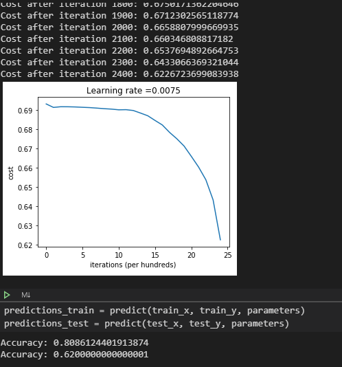
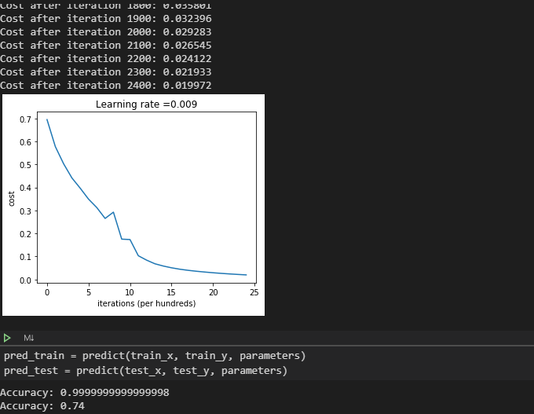
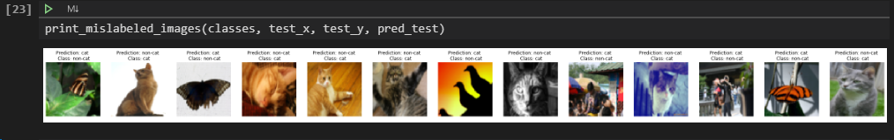
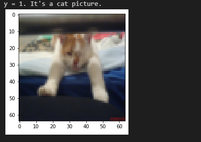

# Image-Classification-Cat-vs-Non-Cat

Image classification is a supervised learning problem: define a set of target classes (objects to identify in images), and train a model to recognize them using labeled example photos. Early computer vision models relied on raw pixel data as the input to the model.

### What is Deep Learning ?
[Deep learning ](https://en.wikipedia.org/wiki/Deep_learning) is probably one of the hottest tech topics right now. Large corporations and young startups alike are all gold-rushing this fancy field. DL can perform outside the machine learning area and comes to assist other areas like computer vision and NLP so that hopefully AI could pass the Turing Test and Total Turing Test one day!

### _In this project we have used two different deep learning methodology to learn the model. They are :_

###  Two-layer neural network :

Displaying Cost of the model after 2300 iterations and the accuracy on the prediction train set and prediction test set.

### L-layer neural network :

Displaying Cost of the model after 2400 iterations and a relatively better accuracy on the prediction train set and prediction test set.

Well , it seems that our 4-layer neural network has better performance (74%) than our 2-layer neural network (62%) on the same test set.

### The result of deep neural network applied on a set of images are :

_Also ,_

### _Packages-to-install :_

 * PIL
 * matplotib
 * scipy
 * numpy
 * h5py
 
 ### _Programming Language used in the project is :_
* Python 
* ML
* Deep Learning
